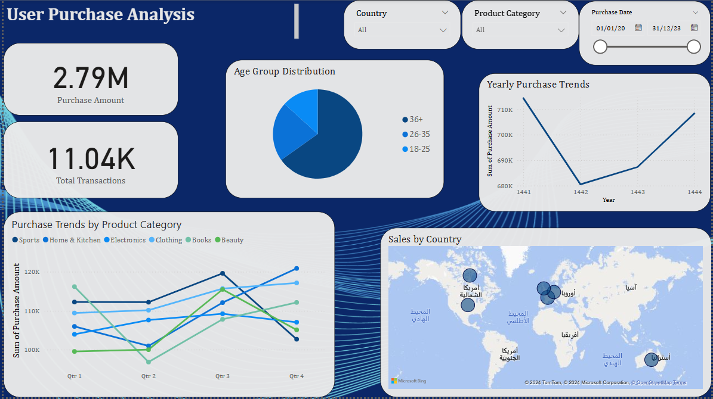

# User Purchase Behavior Analysis Dashboard

## Project Overview
This project provides analysis of user purchase behavior using Power BI.

## Key Features
- **Total Sales and Transactions**
- **Age Group Distribution**
- **Purchase Trends by Product Category**
- **Sales by Country**
- **Annual Sales Trends**

## Screenshots
## 📷 Screenshots

## Technologies Used
- **Power BI**
- **DAX**
- **Power Query**
